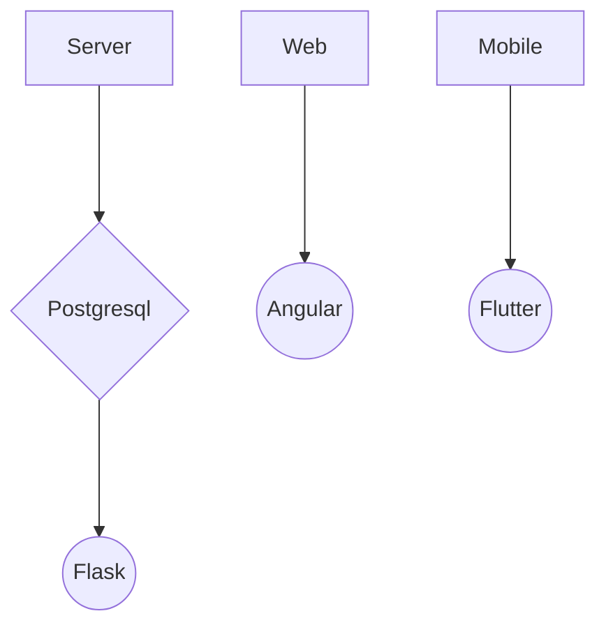

# Area

To start the project, use the commands **docker-compose up --build**

Link to Trello: 
https://trello.com/invite/b/43FaRzr6/383eea2247bfed5a0a3d71ac0464cae4/area

# Commit standard

When a developer want to push, He create the commit like this:  &nbsp;&nbsp;&nbsp;&nbsp;**[<em>type commit</em>] {message}**

Before merging a pull request, you need 2 reviews on it.

When merging, squash your commit for keeping the github clean

# Technical Stack

# Database

[Lien vers la documentation de la Database](database/README.md)

# Documentation API

[Lien vers la documentation API](server/README.md)