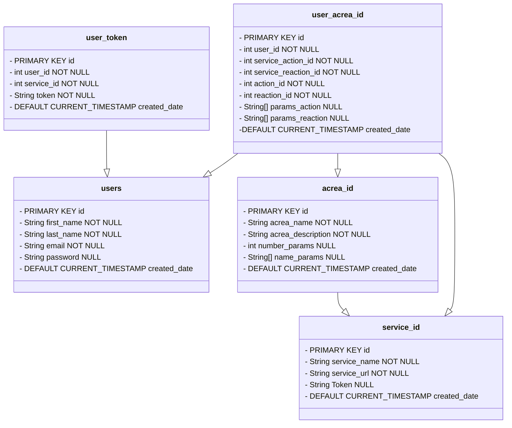

# Documentation Database

```mermaid
classDiagram

user_token --|> users
acrea_id --|> service_id
user_acrea_id --|> acrea_id
user_acrea_id --|> service_id
user_acrea_id --|> users
class users {
    - PRIMARY KEY id
    - String first_name NOT NULL
    - String last_name NOT NULL
    - String email NOT NULL
    - String password NULL
    - DEFAULT CURRENT_TIMESTAMP created_date
}

class user_token {
    - PRIMARY KEY id
    - int user_id NOT NULL
    - int service_id NOT NULL
    - String token NOT NULL
    - DEFAULT CURRENT_TIMESTAMP created_date
}

class service_id {
    - PRIMARY KEY id
    - String service_name NOT NULL
    - String service_url NOT NULL
    - String Token NULL
    - DEFAULT CURRENT_TIMESTAMP created_date
}

class acrea_id {
    - PRIMARY KEY id
    - String acrea_name NOT NULL
    - String acrea_description NOT NULL
    - int number_params NULL
    - String[] name_params NULL
    - DEFAULT CURRENT_TIMESTAMP created_date
}

class user_acrea_id {
    - PRIMARY KEY id
    - int user_id NOT NULL
    - int service_action_id NOT NULL
    - int service_reaction_id NOT NULL
    - int action_id NOT NULL
    - int reaction_id NOT NULL
    - String[] params_action NULL
    - String[] params_reaction NULL
    -DEFAULT CURRENT_TIMESTAMP created_date
}
```